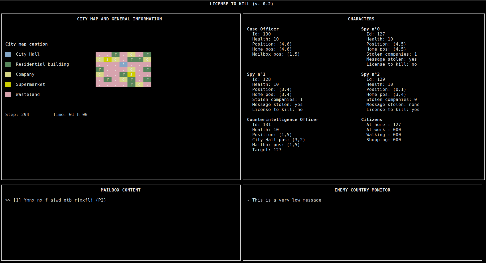

# "License to kill" project 

### Project Credits  
Students:  
- Paul NGUYEN  
- Cécile LU
- Antonio Cimino
  
Course Professor and lab supervisor:  
- Prof. Alain Lebret

## Commands

This command will compile the project and produce all the executable files needed :
```bash
make
```

To start the simulation, the spy simulation must be executed :
```bash
./bin/spy_simulation
```

To change the display mode of the simulation, a macro can be changed in the ./include/memory.h file :
```c
#define DISPLAY 1
```
More information about this macro is given in the said file.

## Monitor program

This program shows a Terminal Graphical Interface with informations about the simulation. 



## Spy Simulation program

This program creates a shared memory containing a structure with all the data of the simulation. it also creates new process for each of the other programs of the simulation.

## Timer program

The timer program periodically sends a signal to the spy simulation program to inform him that the turn is finished. If the simulation ends, it sends a different signal. The spy simulation program then sends a signal to each other process of the simulation to inform them of the next tuen or the end of the simulation.

## Citizen Manager program

This program create a thread for each of the 127 citizen of the simulation. When it receives a signal from spy simulation indicating the next, turn, it then sends a signal to each individual thread to tell them to update. These citizen will be assigned a job, a company, and will follow a routine that is the same each day.

## Enemy Spy Network program

Similarly to citizen manager, this program creates a thread for each of the 3 spies and for the case officer. Their behavior is explained in detail in the doc/project-spies.pdf file but our implementation is a bit simplified.

## Counter Intelligence program

This program simulates the behavior of the counter intelligence officer, which works and live in the city hall. When it detects a suspicious movement near a company at night, it moves there and hide. Then it follows the targeted spy in hope of finding the mailbox that the spy use to communicate with the enemy country.

## Enemy Country program

This program creates a message queue to allow communication between spies and the enemy country. The case officer will send all the messages he got from the mailbox to this message queue specific priorities at 11 pm. and the enemy country will receive it and display it on the enemy country monitor.

## Common Directory

This directory contains object files needed by most of the program above. Functions to use semaphores, cipher and decipher messages, and mapping the shared memory are contained.
